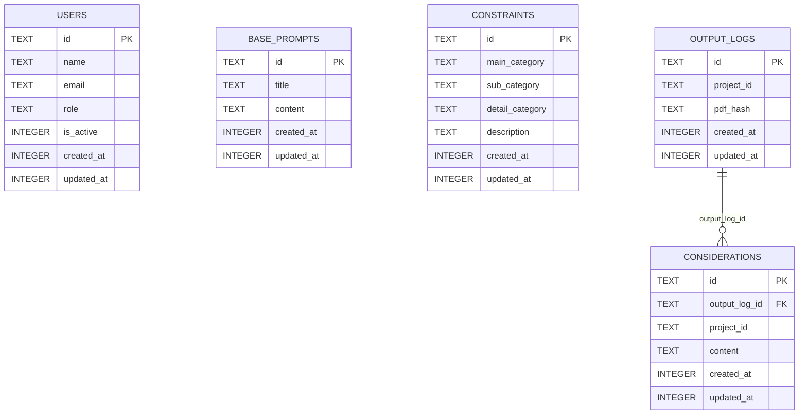

# ERD (D1 Remote) — Real Wall

This document was generated from the **remote Cloudflare D1** database using `wrangler d1 execute --remote`.

- **Database name**: `real-wall-db`
- **Binding**: `DB` (from `wrangler.jsonc`)
- **Generated at**: 2026-03-06

## Mermaid ER diagram (application tables)



## DDL (remote `sqlite_master`)

### `users`

```sql
CREATE TABLE `users` (
	`id` text PRIMARY KEY NOT NULL,
	`name` text NOT NULL,
	`email` text NOT NULL,
	`role` text DEFAULT 'user' NOT NULL,
	`is_active` integer DEFAULT 1 NOT NULL,
	`created_at` integer DEFAULT (unixepoch()) NOT NULL,
	`updated_at` integer DEFAULT (unixepoch()) NOT NULL
)
```

### `base_prompts`

```sql
CREATE TABLE `base_prompts` (
	`id` text PRIMARY KEY NOT NULL,
	`title` text NOT NULL,
	`content` text NOT NULL,
	`created_at` integer DEFAULT (unixepoch()) NOT NULL,
	`updated_at` integer DEFAULT (unixepoch()) NOT NULL
)
```

### `constraints`

```sql
CREATE TABLE `constraints` (
	`id` text PRIMARY KEY NOT NULL,
	`main_category` text NOT NULL,
	`sub_category` text NOT NULL,
	`detail_category` text NOT NULL,
	`description` text NOT NULL,
	`created_at` integer DEFAULT (unixepoch()) NOT NULL,
	`updated_at` integer DEFAULT (unixepoch()) NOT NULL
)
```

### `output_logs`

```sql
CREATE TABLE `output_logs` (
	`id` text PRIMARY KEY NOT NULL,
	`project_id` text NOT NULL,
	`pdf_hash` text NOT NULL,
	`created_at` integer DEFAULT (unixepoch()) NOT NULL,
	`updated_at` integer DEFAULT (unixepoch()) NOT NULL
)
```

### `considerations`

```sql
CREATE TABLE `considerations` (
	`id` text PRIMARY KEY NOT NULL,
	`output_log_id` text NOT NULL,
	`project_id` text NOT NULL,
	`content` text NOT NULL,
	`created_at` integer DEFAULT (unixepoch()) NOT NULL,
	`updated_at` integer DEFAULT (unixepoch()) NOT NULL,
	FOREIGN KEY (`output_log_id`) REFERENCES `output_logs`(`id`) ON UPDATE no action ON DELETE cascade
)
```

## System tables (present in remote DB, omitted from ERD)

- `_cf_KV`
- `d1_migrations`

