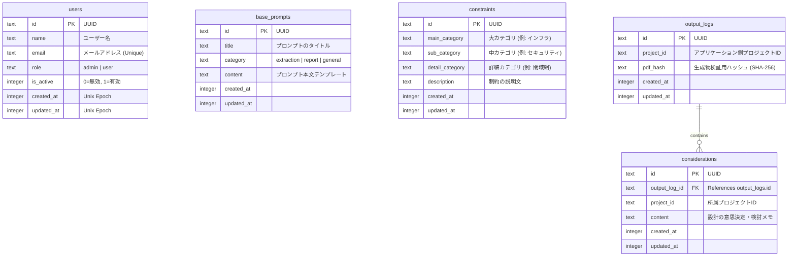

# Entity Relationship Diagram (ERD)

現在の Real Wall プロジェクトのデータベース設計（Cloudflare D1）を Mermaid 記法で可視化した図です。

---

## 各テーブルの役割

### 1. `users`
アプリケーションのユーザー管理を行います。`role` によって管理画面へのアクセスを制御し、`is_active` によってログイン可否を即座に反映します。

### 2. `base_prompts`
AIへの指示文（テンプレート）を管理します。2ステップワークフローに合わせて、`extraction`（論点抽出用）と `report`（報告書生成用）のカテゴリに分類されます。

### 3. `constraints`
設計者に突きつける「壁」のマスターデータです。カテゴリ別に整理され、`MainGenerator` のサイドバーに表示されます。

### 4. `output_logs`
生成されたPDFの整合性を検証するためのテーブルです。`pdf_hash` を保持し、管理画面の Verification 機能でハッシュを照合する際に使用されます。

### 5. `considerations`
ユーザーが各ステップで入力した意思決定メモを保存します。`output_logs` とリレーションを持ち、どの PDF 発行時にどのような検討が行われたかを追跡可能です。
